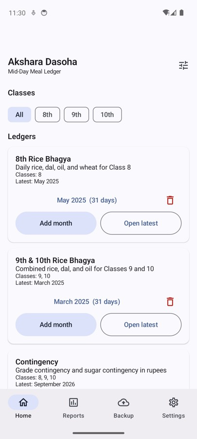
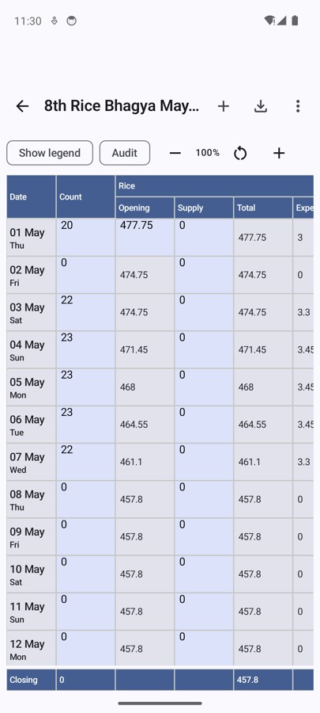
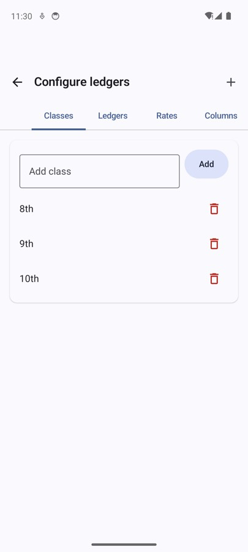
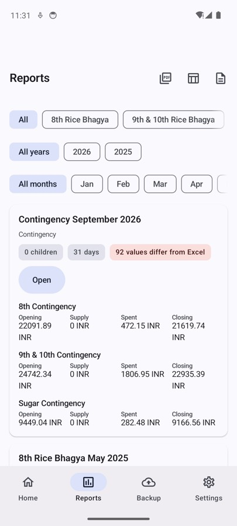
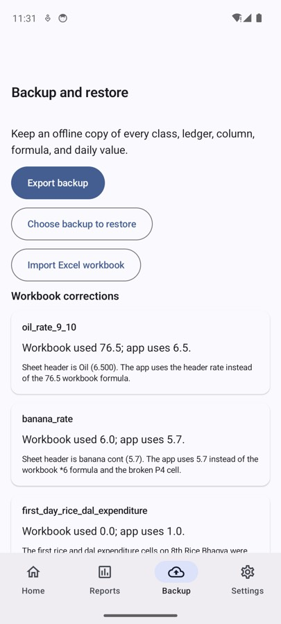
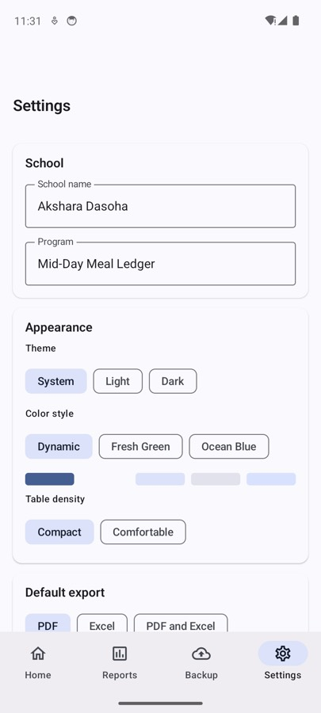

# Akshara Dasoha Ledger

Offline Android app for Karnataka mid-day meal ledgers. It imports `Ledger.xlsx`, organizes books by class, lets you add or remove columns and formulas, prints each month as a landscape PDF, and downloads an editable Excel workbook with native spreadsheet formulas.

**GitHub:** [https://github.com/s4njayr/Akshara-Dasoha](https://github.com/s4njayr/Akshara-Dasoha)  
**Contact:** [s4njay.r@gmail.com](mailto:s4njay.r@gmail.com)

## Clone

```bash
git clone https://github.com/s4njayr/Akshara-Dasoha.git
cd Akshara-Dasoha
```

## Screens

### 1. Home



This is the starting page. Filter by **8th**, **9th**, or **10th**, then pick a ledger such as Rice Bhagya, Milk, Contingency, or Egg and Banana.

- Tap a month name to open that month.
- **Open latest** jumps to the newest month.
- **Add month** creates or opens another month.
- The sliders icon opens **Configure ledgers**.
- The bottom bar switches between Home, Reports, Backup, and Settings.

### 2. Daily ledger



This is the spreadsheet for one month. Date and weekday are fixed. Yellow cells are typed values (head count, supply, first-day opening). Green cells are formulas (total, expenditure, balance).

- **+** adds a missing day.
- The download icon exports the month.
- **More** has print, share PDF, Excel, CSV, audit, and jump to date.
- **Audit** highlights cells that differ from the original Excel file.
- Pinch or use **− / +** to zoom the table.
- The **Closing** row shows the month-end balance.

### 3. Configure ledgers



Use this screen to change the structure of the books without editing code.

- **Classes** — add or remove 8th, 9th, 10th, or another class.
- **Ledgers** — rename a book and choose which classes it belongs to.
- **Rates** — change grams or rupees per child (rice 150 g, banana ₹5.70, and so on).
- **Columns** — add, hide, reorder, or delete columns and edit formulas.
- **Preview** — shows a sample first-day calculation before you save.

A column used by a formula cannot be deleted until that formula is changed.

### 4. Reports



Reports summarize each month: children served, days entered, opening, supply, spent, and closing.

- Filter by ledger, year, and month.
- **Open** jumps back to that month’s table.
- The toolbar icons download **PDF**, **Excel**, or **CSV**.
- A red chip appears when values differ from the original workbook.

### 5. Backup and restore



Keep a copy of every class, ledger, formula, and daily value on this phone.

- **Export backup** writes a JSON archive you can save or share.
- **Choose backup to restore** can merge into this phone or replace local data. Merge keeps months that are not in the file.
- **Import Excel workbook** reads an exported `.xlsx` and updates matching months.
- **Workbook corrections** lists rates the app fixes from the original sheet headers (for example oil 6.5 g instead of 76.5).

### 6. Settings



- **School** and **Program** appear on printed reports and Excel files.
- **Theme** — system, light, or dark.
- **Color style** — Dynamic, Fresh Green, or Ocean Blue.
- **Table density** — compact or comfortable.
- **Language** — English or Kannada.
- **Default export** — PDF, Excel, or both.

## Open in Android Studio

1. Install Android Studio and JDK 17.
2. Open the cloned folder as a Gradle project.
3. Let Gradle sync, then run the `app` configuration on a phone or emulator (API 26+).

If the Gradle wrapper jar is missing, generate it once:

```bash
gradle wrapper --gradle-version 8.9
```

## Install on a phone

Use a **signed** APK. Android will not install `app-release-unsigned.apk`.

1. Build from Android Studio (**Build > Generate Signed App Bundle / APK**) or install the debug build onto a device with USB debugging.
2. On the phone, allow install from unknown sources if you are sideloading.
3. If an older build is already installed and signing does not match, uninstall it first.

## Refresh seed data

```bash
python3 -m venv .venv
.venv/bin/pip install openpyxl
.venv/bin/python tools/import_ledger.py
```

## Tests

```bash
.venv/bin/python -m unittest tools/test_import.py
./gradlew test lint
./gradlew connectedAndroidTest   # device or emulator
```

From a month ledger, use **Download PDF** or **Download Excel**. The Excel file opens in Microsoft Excel, LibreOffice, or Google Sheets. Yellow cells are editable inputs; green cells contain native formulas that recalculate on the computer. Rates live on a dedicated sheet.

Workbook rate corrections are listed in [docs/CORRECTIONS.md](docs/CORRECTIONS.md).
